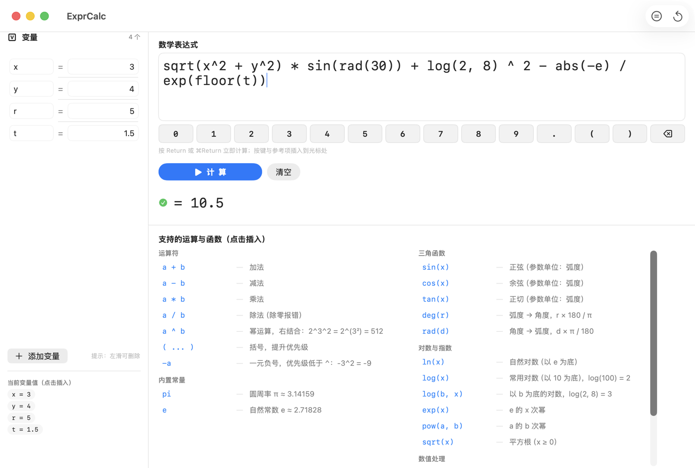

# ExprCalc — macOS 表达式计算器

基于 **SwiftUI** 的 macOS 桌面计算器：直接书写数学表达式求值，支持自定义变量、14 个内置函数、幂运算右结合等完整语法。内置递归下降解析引擎与完整的中文错误提示。



## 功能特性

- **自然书写表达式**：`+ - * / ^`、括号、幂右结合（`2^3^2 = 512`）、一元负号（`-3^2 = -9`）
- **纯鼠标输入**：输入框下方按键行（`0~9` `.` `(` `)` `⌫`）；运算符、函数、常量、变量**点击即插入到光标处**，不碰键盘也能完成计算
- **光标感知插入**：点击 `sin(x)` 后占位符 `x` 自动选中，直接输入即可覆盖；支持 ⌘Z 撤销
- **变量面板**：随时增删改变量，点击变量值标签插入变量名
- **完善的错误处理**：除零、未知函数、参数个数不匹配、多余字符、NaN/溢出等均有中文提示
- **三种计算方式**：`Return`、`⌘Return`、点击「计 算」按钮

## 快速开始

环境要求：macOS 26+、Xcode（含 macOS SDK，Swift 5.9+）。

```bash
git clone https://github.com/foolpanda/ExprCalc.git
cd ExprCalc/ExprCalc

# 一键构建并生成 ExprCalc.app
./build.sh app
open ./ExprCalc.app
```

也可以用 Xcode 打开 `ExprCalc.xcodeproj`，⌘R 运行。

### build.sh 命令

| 命令 | 说明 |
|------|------|
| `./build.sh debug` | 命令行编译 Debug |
| `./build.sh release` | 命令行编译 Release |
| `./build.sh test` | 运行 XCTest 单元测试（27 个用例） |
| `./build.sh app` | 产出 `./ExprCalc.app` |
| `./build.sh verify` | 不依赖 Xcode，纯 Swift 验证表达式引擎 |
| `./build.sh clean` | 清理构建产物 |

## 使用说明

### 界面布局

- **左侧 30% 变量面板**：编辑变量名与值；「添加变量」新增；左滑删除；下方「当前变量值」标签**点击插入**变量名到表达式
- **右侧 70% 表达式区**：输入框 → 按键行 → 计算按钮 → 结果/错误 → 运算与函数参考

### 输入方式

**键盘输入**：直接在输入框书写，按 `Return` 或 `⌘Return` 计算，`⌘Z` 撤销。

**鼠标输入**（无需键盘）：

1. 点击「清空」或用 `⌫` 逐字删除默认表达式
2. 点击按键行输入数字、小数点、括号；退格键删除光标前一个字符
3. 点击下方参考区的运算符（插入 `+` `-` `*` `/` `^` 等）和函数（插入 `sqrt(x)` 等完整形式）
4. 需要变量时，点击左侧「当前变量值」标签插入变量名
5. 点击「计 算」按钮查看结果

> 💡 点击函数（如 `sin(x)`）后，占位符 `x` 处于选中状态，直接输入数字或点击变量即可覆盖；点击 `( ... )` 后光标停在括号内。所有插入均发生在**光标位置**，可与键盘输入自由混用。

## 支持的运算符与函数

### 运算符

| 写法 | 说明 |
|------|------|
| `a + b` / `a - b` / `a * b` / `a / b` | 四则运算，除零报错 |
| `a ^ b` | 幂运算，右结合：`2^3^2 = 2^(3²) = 512` |
| `( ... )` | 括号，提升优先级 |
| `-a` | 一元负号，优先级低于 `^`：`-3^2 = -9` |

### 函数

| 函数 | 说明 |
|------|------|
| `sin(x)` `cos(x)` `tan(x)` | 三角函数（参数为弧度） |
| `deg(r)` / `rad(d)` | 弧度 → 角度 / 角度 → 弧度 |
| `ln(x)` | 自然对数（以 e 为底） |
| `log(x)` | 常用对数（以 10 为底），`log(100) = 2` |
| `log(b, x)` | 以 b 为底的对数，`log(2, 8) = 3` |
| `exp(x)` | e 的 x 次幂 |
| `pow(a, b)` | a 的 b 次幂 |
| `sqrt(x)` | 平方根（x ≥ 0） |
| `abs(x)` | 绝对值 |
| `ceil(x)` / `floor(x)` | 向上 / 向下取整 |
| `round(x)` | 四舍五入（.5 向偶数） |

### 内置常量

`pi` ≈ 3.14159，`e` ≈ 2.71828

## 表达式示例

| 表达式 | 结果 | 说明 |
|--------|------|------|
| `sqrt(x^2 + y^2)` | `5` | 默认示例（x=3, y=4） |
| `2 ^ 3 ^ 2` | `512` | 幂右结合 |
| `-3 ^ 2` | `-9` | 一元负号低于 `^` |
| `log(2, 8)` | `3` | 两参数对数 |
| `sin(rad(30))` | `0.5` | 角度转弧度后求正弦 |
| `pi * r ^ 2` | `78.5398` | 圆面积（r=5） |
| `round(2.5)` | `2` | .5 向偶数舍入 |
| `exp(ln(5))` | `5` | 函数复合 |

截图中的综合示例：`sqrt(x^2 + y^2) * sin(rad(30)) + log(2, 8) ^ 2 - abs(-e) / exp(floor(t))` **= 10.5**

## 项目结构

```
ExprCalc/
├── ExprCalc.xcodeproj
├── ExprCalc/                     # 应用源码
│   ├── ExprCalcApp.swift         # App 入口
│   ├── ContentView.swift         # 主界面（输入/按键行/参考/变量面板）
│   ├── ExprEvaluator.swift       # 表达式引擎（词法分析 + 递归下降）
│   └── Assets.xcassets/          # 应用图标、强调色
├── ExprCalcTests/                # XCTest 单元测试
├── ExprCalc_Complete.swift       # 单文件完整版（新建工程时替换 ContentView.swift）
├── Scripts/
│   └── make_icon.swift           # 应用图标生成脚本
├── Docs/
│   └── screenshot.png            # README 截图
├── build.sh                      # 一键构建脚本
└── verify_engine.swift           # 引擎独立验证（无需 Xcode）
```

## 重新生成应用图标

图标由脚本矢量渲染（蓝色渐变圆角方块 + 白色 √x，SF Pro Rounded Bold），输出全部 10 个标准尺寸：

```bash
swift Scripts/make_icon.swift ExprCalc/Assets.xcassets/AppIcon.appiconset
```

修改脚本中的配色与文字后重新执行，再 `./build.sh app` 即可换图标。
